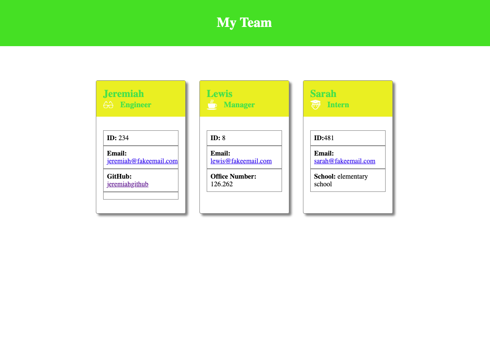

# My Team Profile Generator-11

## Description
My name is Jeremiah and I present to you my Command-Line Application. Th application wil include information about employees on a Software Engineering team. Also, this application will then generate an HTML webpage that shows information about each person.

## Visuals

Beloew is the HTML page that the application will look like.

[My Presentation Video](.//Assets/images/Video1.webm)

## Usuage
When I start the application, I will first check and make sure my test run smoothly with the, "npm test" command. Once every test has passed, I wil start the application with "node index.js".

## Authors and Acknowledgment
I would like to thank my instructors for always pushing me and understanding how hard coding can be at a fast pace.

 

README is maintained by <h2>Jeremiah Warren</h2>, followed by the [TeamProfileGenerator11](https://github.com/Jwarren619/TeamProfileGenerator11) and hosted on [GitHub](https://github.com/Jwarren619).
